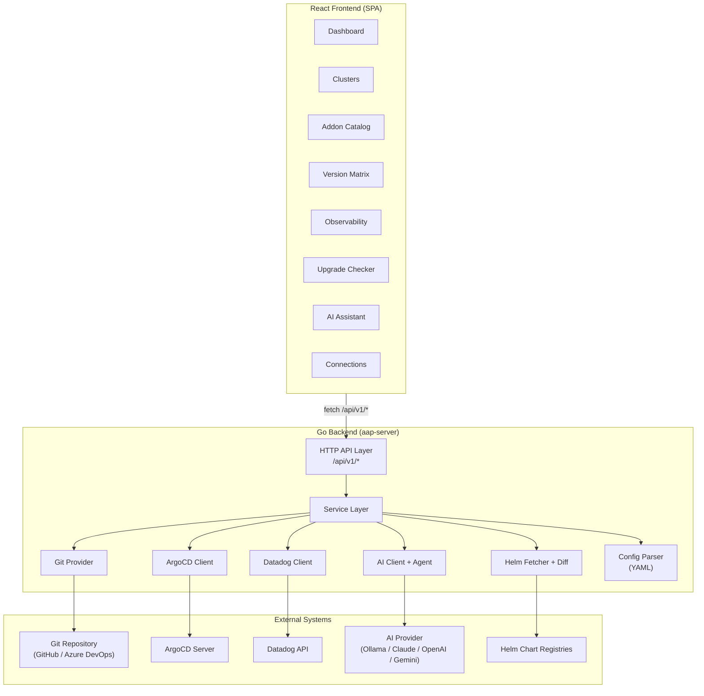
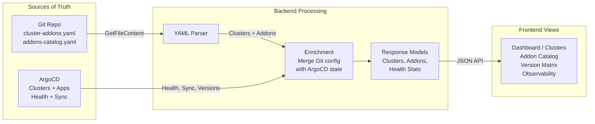
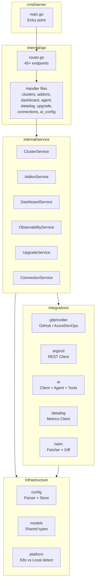
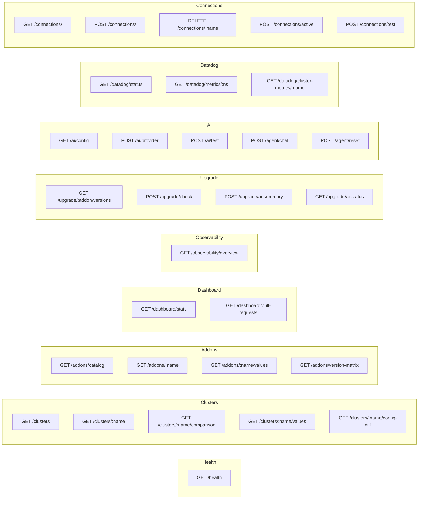
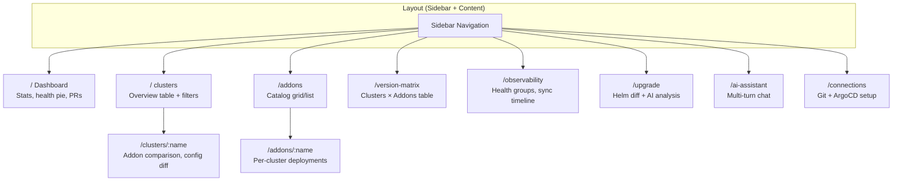
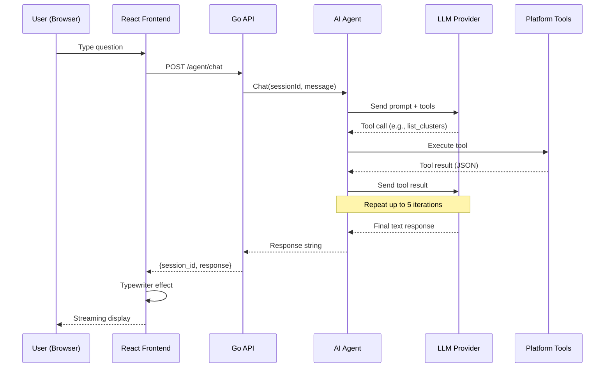
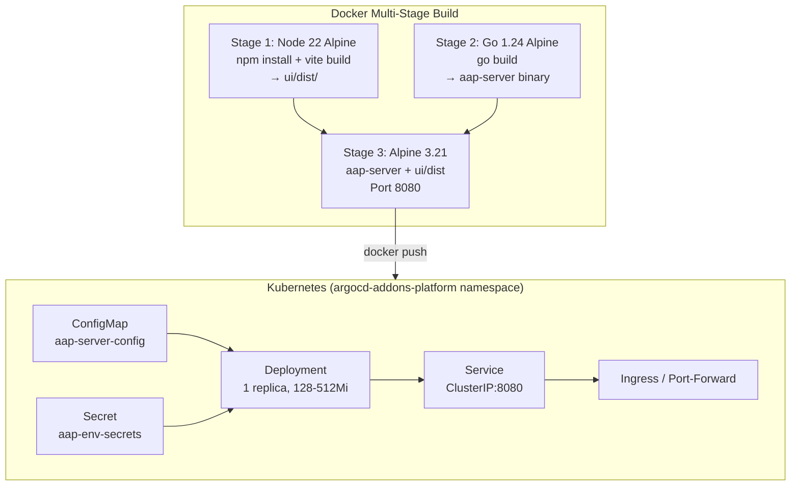

# ArgoCD Addons Platform — Architecture

## System Overview



## Data Flow: Git to UI



## Backend Package Architecture



## API Endpoint Map



## Frontend Route Map



## AI Agent Tool Calling Flow



## Deployment Architecture



## External Integration Points

```
┌─────────────────────────────────────────────────────────────────┐
│                    AAP Backend (Go)                              │
│                                                                 │
│  ┌──────────┐  ┌──────────┐  ┌──────────┐  ┌───────────────┐  │
│  │ Git      │  │ ArgoCD   │  │ Datadog  │  │ AI Provider   │  │
│  │ Provider │  │ Client   │  │ Client   │  │ Client+Agent  │  │
│  └────┬─────┘  └────┬─────┘  └────┬─────┘  └──────┬────────┘  │
│       │              │              │               │           │
└───────┼──────────────┼──────────────┼───────────────┼───────────┘
        │              │              │               │
        ▼              ▼              ▼               ▼
   ┌─────────┐  ┌───────────┐  ┌──────────┐  ┌─────────────┐
   │ GitHub  │  │ ArgoCD    │  │ Datadog  │  │ Ollama      │
   │ API     │  │ REST API  │  │ API      │  │ Claude      │
   │         │  │ (bearer)  │  │ (apikey) │  │ OpenAI      │
   │ Azure   │  │           │  │          │  │ Gemini      │
   │ DevOps  │  │           │  │          │  │             │
   └─────────┘  └───────────┘  └──────────┘  └─────────────┘
     OAuth2/       JWT           API+App       API Key /
     PAT           Token         Keys          Local (Ollama)

   Required ✓      Required ✓   Optional       Optional
   (core data)    (live state)  (metrics)      (AI features)
```
